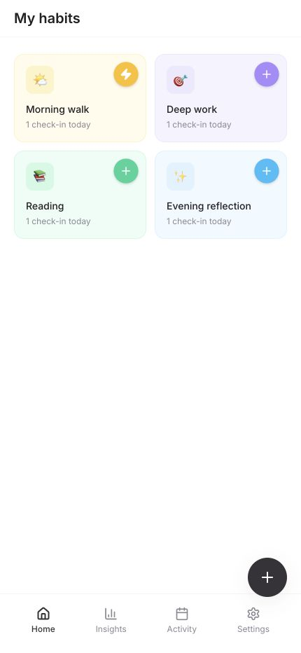
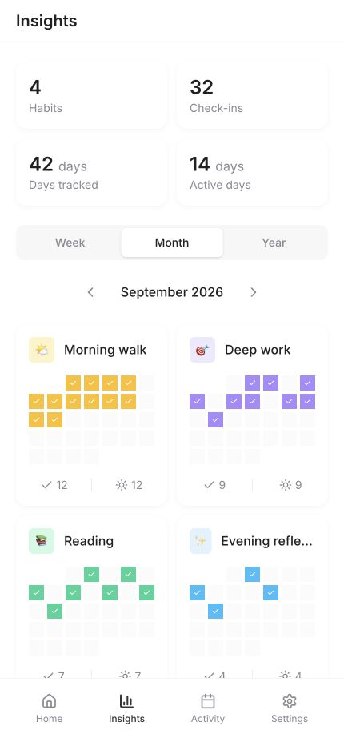
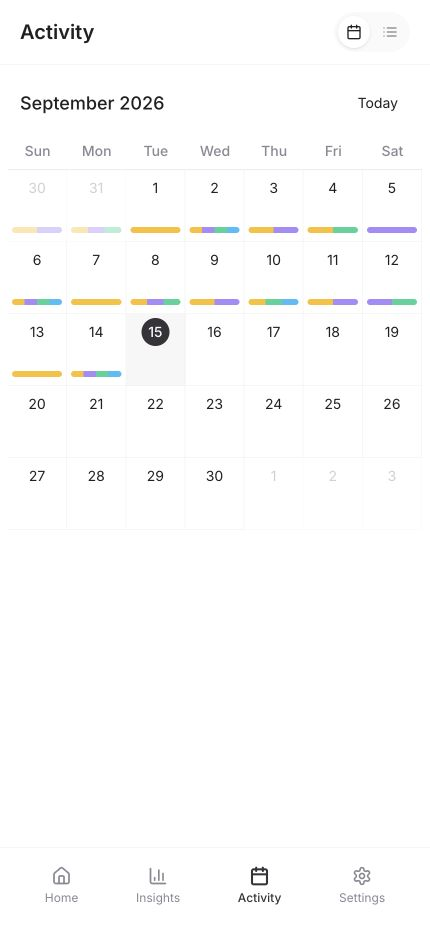
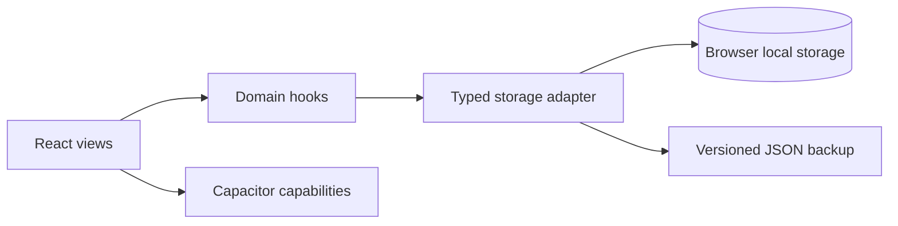

<div align="center">
  

  # HabitFlow

  **A private, local-first habit and life tracker built for frictionless check-ins.**

  Track repeatable habits, one-time milestones, and richer life logs in one calm, mobile-first experience.

  [](https://github.com/elena0x/elena-habit-tracking/actions/workflows/ci.yml)
  [](https://react.dev/)
  [](https://www.typescriptlang.org/)
  [](https://capacitorjs.com/)
</div>

<p align="center">
  
  
  
</p>

## Why HabitFlow?

Many habit trackers reduce every behavior to the same binary streak. HabitFlow is designed around a more flexible idea: a morning walk should be one tap, while a workout, journal entry, or expense may need structured context.

The result is a local-first product that keeps simple actions fast without limiting richer tracking workflows.

## Product highlights

- **Three tracking modes** — repeatable habits, one-time milestones, and detailed logs.
- **One-tap check-ins** — quick-record mode with immediate visual feedback and native haptics.
- **Flexible custom fields** — number, text, time, rating, yes/no, single-select, and multi-select inputs.
- **Useful starting points** — 18 editable templates across health, learning, fitness, and everyday life.
- **Progress at a glance** — weekly, monthly, and yearly heatmaps plus habit-level summaries.
- **Calendar and timeline views** — move between patterns and individual moments without losing context.
- **Portable, private data** — browser-local storage with versioned JSON import/export; no account required.
- **Cross-platform foundation** — a responsive React app wrapped for iOS and Android with Capacitor.

## Engineering highlights

| Area | Implementation |
| --- | --- |
| Frontend | React 18, TypeScript, Vite, React Router |
| UI system | Tailwind CSS, shadcn/ui, Radix UI, Lucide icons |
| Data model | Typed habits, check-ins, and configurable field schemas |
| Persistence | Defensive local storage adapter with legacy-key migration and portable backups |
| Native UX | Capacitor status bar, splash screen, keyboard, Android back handling, and haptics |
| Quality | Type checking, ESLint, Vitest, production build, dependency audit, and GitHub Actions |



For the deeper design and data-flow notes, see [Architecture](./docs/ARCHITECTURE.md).

## Quick start

### Prerequisites

- Node.js 22.12 or newer
- npm 10 or newer

### Run locally

```bash
git clone https://github.com/elena0x/elena-habit-tracking.git
cd elena-habit-tracking
npm ci
npm run dev
```

Open `http://localhost:8080` in your browser. To explore a populated version without creating data manually, open `http://localhost:8080/?demo=1` in a fresh browser profile. Demo mode only seeds an empty local store and never overwrites existing habits.

### Quality checks

```bash
npm run check
```

This runs TypeScript, linting, the test suite, a production build, and a production-dependency audit—the same gates used in CI.

## Native development

Build the web application before syncing a native target:

```bash
npm run build
npx cap add ios       # first time only
npx cap add android   # first time only
npx cap sync
npx cap open ios      # or: npx cap open android
```

The native shell adds safe-area support, haptic feedback, splash-screen handling, keyboard resizing, and platform back behavior.

## Project structure

```text
src/
├── components/       Reusable product and UI components
├── hooks/            Habit, check-in, gesture, and native behaviors
├── lib/              Storage, dates, colors, and demo data
├── pages/            Main, habit detail, settings, and fallback routes
├── test/             Shared Vitest environment setup
└── types/            Domain types for habits and check-ins
docs/
├── assets/            Verified product screenshots
└── ARCHITECTURE.md    Technical decisions and data flow
```

## Design decisions and trade-offs

- **Local-first by default.** The app is instant and private, but data does not sync across devices yet.
- **Flexible records over rigid streaks.** Custom fields support more real-life use cases, while adding schema and validation complexity.
- **Shared web codebase.** Capacitor keeps product iteration fast across platforms; deeply platform-specific experiences may still require native extensions.
- **Opt-in demo data.** Reviewers can evaluate realistic states quickly, and the seed guard protects existing local data.

## Roadmap

- Accessible interaction audit and keyboard-flow coverage
- Backup schema validation and future-version migrations
- Optional encrypted cross-device sync
- Offline installability and reminder scheduling
- End-to-end coverage for the highest-value check-in flows

## Author

Designed and built by [Elena (@elena0x)](https://github.com/elena0x).

If you are reviewing this project for a role, the most useful places to start are the [product data model](./src/types/index.ts), [storage boundary](./src/lib/storage.ts), [tracking flow](./src/pages/Index.tsx), and [technical decisions](./docs/ARCHITECTURE.md).
