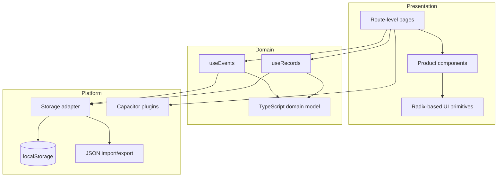

# HabitFlow architecture

This document explains the architectural choices behind HabitFlow and the trade-offs that matter most when extending it.

## System overview

HabitFlow is a client-side React application with a Capacitor native shell. It intentionally has no required backend: habits and check-ins are written to browser local storage through one typed adapter, while JSON backups provide user-controlled portability.

## Domain model

The model separates the thing being tracked from each observation:

- An `Event` defines a habit or life-log schema: name, tracking mode, color, icon, quick-record behavior, and optional attributes.
- An `EventRecord` is an immutable check-in linked by `eventId`, with a calendar date, optional time and note, and structured `extra` values.
- An `EventAttribute` describes one custom field. Seven field types cover quantitative, categorical, free-form, boolean, rating, and time-based data.

This schema keeps one-tap habits lightweight while allowing richer activities to capture useful context.

## State and persistence

`useEvents` and `useRecords` own in-memory React state and expose task-focused operations to the UI. Every mutation is also written through `src/lib/storage.ts`, keeping persistence details out of page components.

The storage boundary provides:

- defensive reads when stored JSON is missing or malformed;
- migration from the two keys used by earlier versions;
- cascading record deletion when a habit is removed;
- versioned, portable backup exports;
- validation before an imported backup replaces current data;
- one clear operation that removes both current and legacy data.

For a larger product, this adapter is the natural seam for IndexedDB or encrypted cloud synchronization.

## Time handling

Calendar dates are stored as local `YYYY-MM-DD` strings because a habit check-in belongs to the date the user experienced, not a UTC boundary. Creation timestamps remain ISO strings for ordering. This distinction prevents evening check-ins from appearing on the following day when the app is used outside a fixed timezone.

## Native boundary

The React application remains web-compatible. Native-only behaviors are isolated in hooks and guarded with `Capacitor.isNativePlatform()`, so unsupported capabilities fail gracefully instead of blocking the core experience.

Current native integrations include haptics, status-bar styling, splash-screen dismissal, keyboard resizing, safe-area layout, and Android hardware-back behavior.

## Quality strategy

The repository uses one local and CI command, `npm run check`, to enforce:

1. TypeScript compilation without emitting files.
2. ESLint rules, including React Hooks checks.
3. Vitest coverage for dates, backups, migration, and malformed input.
4. A production Vite build.
5. A production-dependency security audit.

The next testing investment should be browser-level coverage for creating a habit, recording a structured check-in, importing a backup, and navigating the calendar.

## Key trade-offs

| Decision | Benefit | Cost / future consideration |
| --- | --- | --- |
| Local storage | Private, instant, account-free onboarding | No cross-device sync and finite browser storage |
| React hooks for domain state | Small API surface and easy component integration | Multiple hook instances read independently from persistence |
| Configurable attributes | One model supports many life-tracking use cases | Imported data needs stronger schema/version migration over time |
| Capacitor wrapper | One product codebase for web, iOS, and Android | Platform-specific features still require native testing |
| Client-side analytics | No personal data leaves the device | Large datasets will eventually need indexed queries or aggregation |
